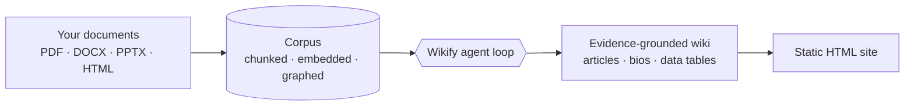
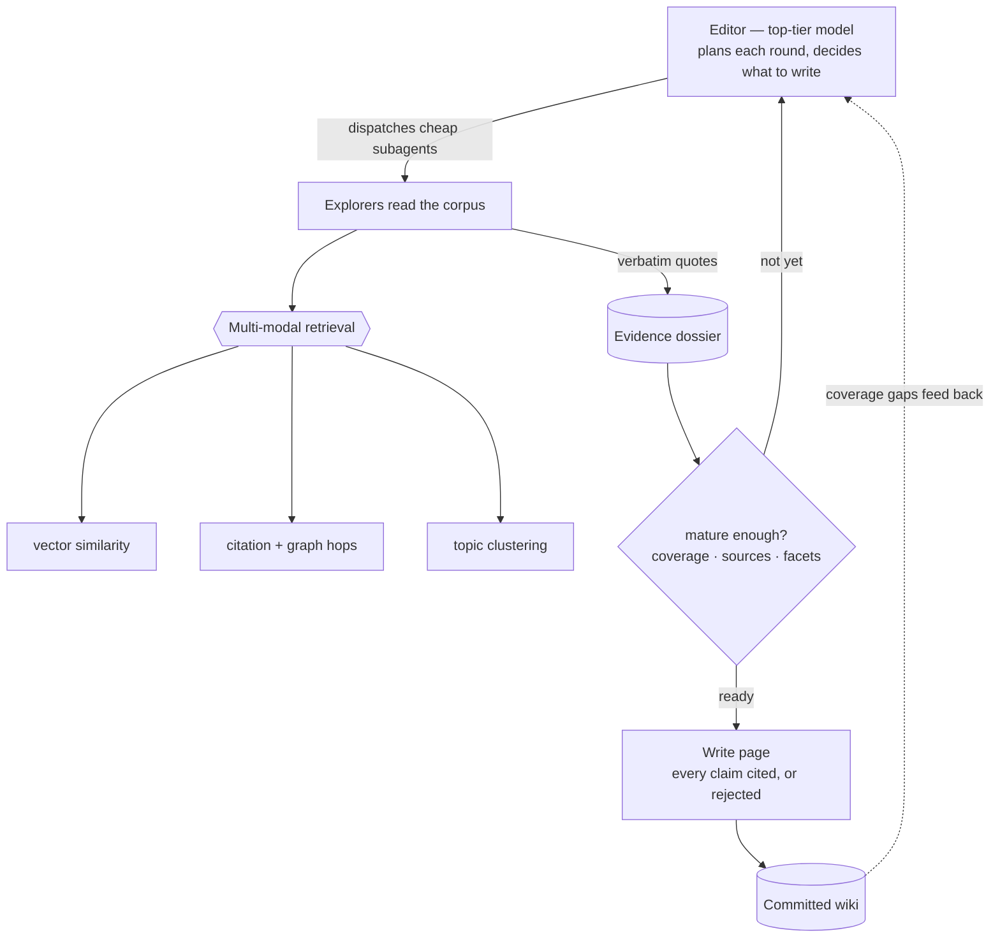
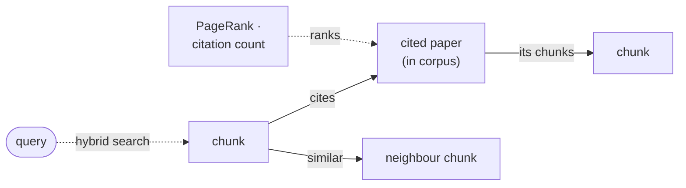

# Wikify

**Turn a folder of documents into a navigable, evidence-grounded wiki —
researched and written by an AI agent, with every claim traceable to a
real quote in your sources.**

[](https://github.com/fgrillo89/wikify/actions/workflows/ci.yml)
[](https://codecov.io/gh/fgrillo89/wikify)
[](LICENSE)
[](pyproject.toml)
[](https://github.com/astral-sh/ruff)

Point Wikify at a pile of research papers (PDF, or DOCX / PPTX / HTML /
Markdown). It parses them into a searchable **corpus** — including each
paper's reference list, resolved to DOIs and linked to the works it cites
inside your collection — then an agent reads that corpus the way a
researcher would and writes a browsable encyclopedia — articles, short
biographies, and data tables — as a self-contained static HTML site.

Wikify is built for scientific literature: it understands that papers
cite papers, and it uses that structure to retrieve.



## Why Wikify

- **Grounded, not generated.** Every factual sentence traces to a
  verbatim quote that really exists in your sources. A fabricated quote
  fails an automatic check and the page is rejected — no hallucinated
  citations.
- **Built for research papers.** Reference lists are parsed and resolved
  (DOI / BibTeX), and each chunk is linked to the corpus papers it cites,
  so the agent can follow the citation graph — not just vector similarity.
- **Agentic and multi-tier.** A top-tier *editor* model plans and decides
  what to write; cheap *explorer* subagents do the bulk reading. You pay
  premium rates for judgment, not for page-turning.
- **Reads across documents, not one at a time.** It chases a thread
  through the corpus using vector similarity, the citation graph,
  multi-hop traversal, and topic clusters — like a researcher following
  references, not one-shot RAG.
- **Whole-corpus coverage.** It keeps working until topics saturate, so
  the wiki reflects what the documents collectively say, instead of
  answering one question and stopping.
- **Context-managed at scale.** Explorers summarize as they read; the
  editor reasons over scores and summaries, never raw dumps — so it
  holds up on large corpora.

## How wikification works

The agent works in rounds, like a research editor running a newsroom. It
never reads every document itself. Each round it sizes up the state,
dispatches cheap explorer subagents to gather **evidence** (verbatim
quotes) for the topics that need it, scores how ready each topic is, and
writes a page only once that topic crosses a maturity bar. Coverage gaps
feed the next round, so the wiki fills in until it saturates.



Two output layers come out of a run: the **wiki page graph** (articles
and biographies, linked together and queryable) and a separate
**data-artifact layer** of `kind=data` tables that harvest verifiable
numbers across the corpus and re-derive from a stored spec. See
[docs/overview.md](docs/overview.md) for the full loop.

## Beyond classic RAG

Classic RAG embeds your chunks, retrieves the top-_k_ most similar to a
query, and stuffs them into a prompt. That discards everything that makes
a research library navigable: who cites whom, which papers are central,
and how a claim connects back to its sources.

Wikify treats the corpus as a **graph of research papers**, not a bag of
chunks. At ingest it parses each paper's reference list, resolves the
citations, and links every chunk to the corpus papers it cites. On top of
that graph the agent gets both state-of-the-art retrieval **and**
structural traversal:



- **Hybrid search, not just cosine top-_k_.** Dense vector similarity,
  sparse **BM25** (great for acronyms and exact terms), and literal
  substring, fused with reciprocal-rank fusion.
- **Citation hops.** From any chunk, follow the papers it cites that are
  *in your corpus*, then read their chunks — chasing a reference the way
  you would.
- **Chunk-to-chunk similarity walks.** Hop across dense neighbours to
  expand a topic boundary.
- **Graph-metric ranking.** Rank papers (or authors) by **PageRank** or
  **citation count** to start from the most central work, or find the
  most-cited paper that discusses a topic.

The result combines the recall of hybrid RAG with the precision of
following a real citation graph — so the agent reads a corpus the way a
researcher reads a field, not as isolated passages.

## The corpus through MCP

The agent reaches the corpus over an MCP server, which exposes that whole
surface as composable tools — usable from Claude Code or any MCP client:

| Tool | What it does |
|------|--------------|
| `corpus_find` | semantic / BM25 / hybrid / RRF-fused search over chunks; rank papers or authors by `pagerank` or `citation_count` |
| `corpus_traverse` | graph traversal — a chunk's in-corpus citations, an author's papers, neighbours by edge kind |
| `corpus_citation_walk` | multi-hop walk over the citation graph |
| `corpus_similarity_walk` | dense chunk-to-chunk neighbour hops |
| `corpus_show` / `corpus_sample` / `corpus_schema` / `corpus_image` | read chunks, sample diverse entry points, inspect the schema, fetch figures |

These compose into a literature review in a few calls: rank the most-cited
paper on a topic, open its chunks, hop to what it cites in the corpus,
then similarity-walk outward. See [Use as an MCP server](#use-as-an-mcp-server)
to wire it up.

## Quickstart

Requires Python >= 3.12 and [uv](https://docs.astral.sh/uv/).

```bash
git clone https://github.com/fgrillo89/wikify.git
cd wikify
uv sync
uv run wikify --help
```

First-run note: the default Docling parser downloads the Granite formula
model (~258 MB) plus layout/table models on the first parse. Pass
`--parser lite` for a model-free, CI-friendly path.

## Worked example

```bash
# 1. Ingest a folder of documents into a corpus
uv run wikify corpus build ./papers --out data/corpora/ald

# 2. Build the wiki. Run the `wikify` skill from Claude Code against the
#    corpus; it initialises a bundle and drives the editor/explorer loop.
#    The bundle is bootstrapped with:
uv run wikify run init --bundle bundles/ald --corpus data/corpora/ald

# 3. Render the committed wiki to a self-contained static site
uv run wikify render --bundle bundles/ald
#    -> bundles/ald/derived/site/index.html
```

The flow is `ingest -> wikify -> render`: a read-only **corpus**, the
agent loop that fills a **bundle** with grounded pages, then a static
**site**.

## Skills

Wikify is driven by four first-class skills (run them from Claude Code);
each wraps a deterministic `wikify` CLI and MCP surface.

- **`arxiv`** — harvest arXiv papers for a topic and stage them for a
  build: scout categories, harvest metadata, download PDFs.
- **`ingest`** — parse a directory of documents into a queryable corpus;
  owns parser-backend choice and post-build health checks.
- **`wikify`** — the researcher-style agent loop. An editor dispatches
  explorer subagents that walk the corpus, gather evidence into dossiers,
  and write pages once a maturity score crosses the gate; a DATA wave
  harvests verifiable numbers into `kind=data` tables.
- **`query`** — answer a question from the committed wiki, falling back to
  corpus search when the wiki is insufficient, and recording feedback.

## Use as an MCP server

Wikify exposes its corpus and wiki search tools to Claude Code over a
stdio MCP server. To wire it into a project:

```bash
cp .mcp.json.example .mcp.json
# edit WIKIFY_CORPUS in .mcp.json to point at a built corpus, e.g.
#   data/corpora/ald
```

Reload Claude Code and approve the one-time "Use this project's MCP
server `wikify`?" prompt. The `mcp__wikify__*` tools then load. The
server binds a corpus from `WIKIFY_CORPUS`, or autodetects one when
launched from inside a corpus directory. `.mcp.json` is gitignored
(it holds machine-specific paths); the committed
[`.mcp.json.example`](.mcp.json.example) is the template. Alternatively,
install the bundled Claude plugin under `.claude-plugin/`, which ships
the same server plus the skills and prompts for a corpus path on install.

## Documentation

Start at the [docs overview](docs/overview.md), then follow the branch you
need. Full map in [docs/README.md](docs/README.md).

- [overview.md](docs/overview.md) — concepts (corpus, chunk, bundle, wiki,
  dossier, evidence, maturity, data artifact) and the agent loop.
- [architecture.md](docs/architecture.md) — agent runtime, CLI/MCP tools,
  the on-disk bundle, citation grounding, telemetry.
- [filesystem-state-design.md](docs/filesystem-state-design.md) — the
  durable on-disk contract for a bundle.
- [ingestion-and-parsing.md](docs/ingestion-and-parsing.md) — files to
  corpus chunks, embeddings, and graph.
- [wiki-rendering.md](docs/wiki-rendering.md) — the static HTML site.
- [metrics.md](docs/metrics.md) — the evaluation metrics over a bundle.
- [databases.md](docs/databases.md), [vector-search.md](docs/vector-search.md),
  [references.md](docs/references.md) — storage, search, and reference
  resolution internals.

## Contributing

Dev setup is `uv sync`; lint with `uv run ruff check src/wikify tests/wikify`
and test with `uv run pytest tests/wikify -q`. See
[CONTRIBUTING.md](CONTRIBUTING.md) for branch, commit, and review conventions.

## License

[Business Source License 1.1](LICENSE) (BUSL-1.1). The source is available and
free for non-production use and for production use other than offering Wikify
to third parties as a hosted or managed service (see the Additional Use Grant
in [LICENSE](LICENSE)). Each version converts to the Apache License 2.0 four
years after its release. For a commercial license, contact the maintainer.
