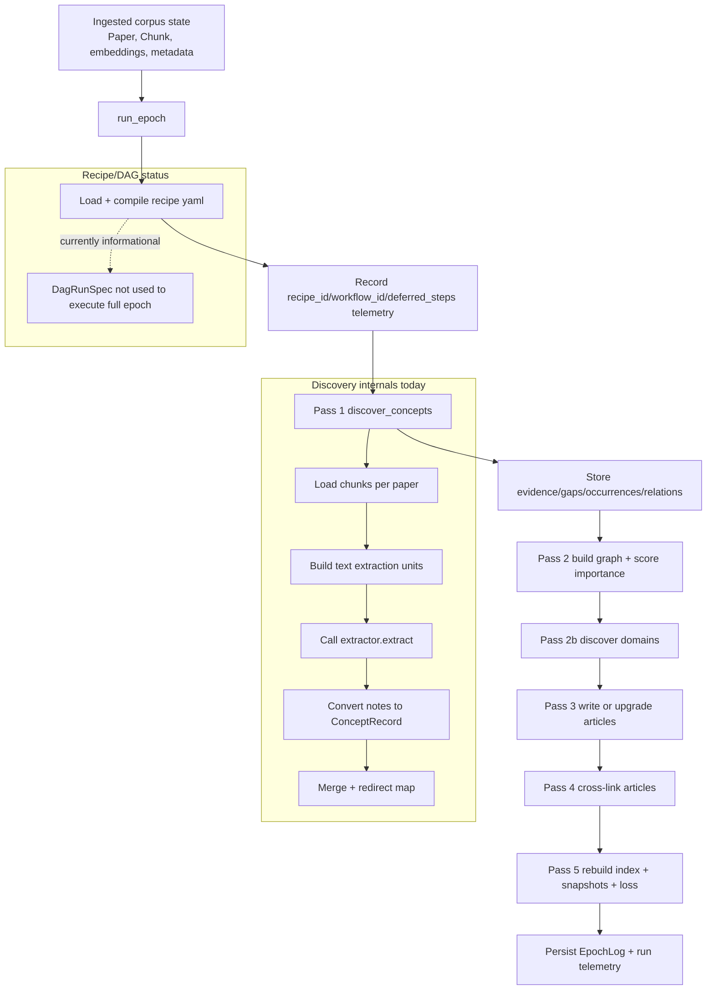

# Wiki Epoch Pipeline Review (As Implemented)

Status: review snapshot as of 2026-04-07.

## Scope
This note explains the current wiki pipeline after ingest, with focus on:

- epoch execution flow
- how configuration is applied today
- how close the implementation is to the architecture and refactor plans
- where modularity and configurability are still weak

Related docs:

- `docs/architecture.md`
- `docs/refactor/wiki-deep-refactor-plan.md`
- `docs/design/wiki-runtime-refactor-plan.md`
- `docs/design/workflow-config-redesign.md`

## Executive Summary
The refactor made real progress on boundaries and package structure, but the
epoch hot path is still mostly imperative and only partially wired to the new
recipe/DAG layer.

What is solid:

- `core`, `ingest`, `wiki`, `papers` boundaries are now visible in code.
- `wiki/discovery/` has typed contracts, DAG validation/execution primitives,
  recipe parsing, and a compiler.
- `wiki/graph/` and `wiki/observability/` are now explicit packages.

What is still incomplete:

- `run_epoch` still executes legacy pass sequencing directly.
- recipe compile output is currently observability metadata, not the execution
  substrate for the full epoch.
- discovery defaults to `EchoExtractor` when no runtime extractor is injected,
  so concept discovery can degenerate to a no-op for new concepts.
- recipe references prompts/schemas that do not exist yet.

## Current Epoch Pipeline
The current flow starts from ingested corpus rows (`Paper`, `Chunk`, etc.) and
then runs `wiki.epoch.run_epoch`.

High-level steps in `run_epoch`:

1. load and compile `recipes/default_publication.yaml` (metadata only today)
2. Pass 1: concept discovery (`wiki.concepts.discover_concepts`)
3. Pass 2: concept graph construction and scoring
4. Pass 2b: domain discovery
5. Pass 3: article write/upgrade loop
6. Pass 4: cross-linking
7. Pass 5: index rebuild, telemetry finalization, loss and convergence checks

## Diagram

## Configuration Reality Check
Configured today:

- recipe id and step metadata are loadable from `wiki/recipes/default_publication.yaml`
- recipe hash/workflow id/deferred steps are captured in observability
- discovery contracts and DAG executor are implemented and testable in isolation

Not configured end-to-end yet:

- full epoch execution is not driven by compiled DAG nodes
- recipe steps `cross_link`, `write_articles`, and `maintain` are deferred by
  compiler design
- several prompt/schema files referenced by recipe are missing, so those
  references are currently declarative only

## Architecture and Plan Alignment
Alignment:

- boundary separation is mostly in place
- discovery package exists with explicit contracts
- graph and observability ownership is clearer

Gaps:

- `wiki/runtime.py` and `wiki/epoch.py` are still large and not a thin facade
- `wiki/operations/` split is not complete
- `WikiUpdateBundle` exists but is not yet the central mutation surface in the
  runtime
- discovery is not yet document-type-routed in epoch execution; the default
  concept path still assumes publication/text chunk flow

## Prioritized Improvements
P0 (correctness and trust):

1. wire a real runtime `AgentExtractor` into epoch discovery path
2. fail fast when recipe references missing prompt/schema files
3. add an explicit runtime mode that errors if discovery runs with
   `EchoExtractor` outside tests/dry-run

P1 (configurability):

1. execute Pass 1 through compiled recipe/DAG, not only compile for telemetry
2. implement non-deferred recipe steps for `cross_link`, `write_articles`,
   `maintain` or split recipe into discovery-only and full-epoch recipes with
   explicit contracts
3. add per-step config validation:
   - required files exist
   - model tiers resolve
   - unit kinds are supported

P2 (modularity and clarity):

1. split `wiki/epoch.py` into `wiki/operations/epoch.py` plus focused helpers
2. split `wiki/runtime.py` into operation modules and keep runtime as adapter
3. adopt `WikiUpdateBundle` in epoch/query/maintain mutations so visible and
   structured updates share one envelope

## Recommended Epoch Config Model
A practical sequence to get to the intended design without destabilizing
existing behavior:

1. use recipe compiler to drive only Pass 1 (discovery) first
2. keep Pass 2-5 imperative for one transition slice
3. add compiled workflow artifact export per run:
   `data/wiki/_meta/runs/<run_id>/compiled_workflow.yaml`
4. after Pass 1 is stable, migrate graph/article/link/maintain steps behind
   node contracts
5. then make epoch orchestration purely workflow-driven

This keeps risk bounded and still delivers immediate configurability where it
matters most: concept/entity extraction and frontier strategy.

