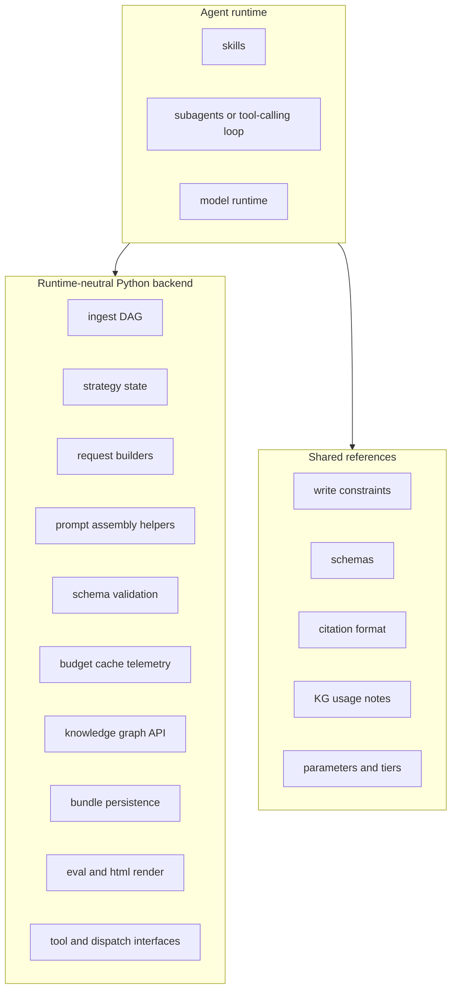

# Wikify: skill-centric pivot (agent-driven, tool-backed)

## Review outcome

This revision adopts the architecture the user wants:

- The agent runtime is the only place that calls models.
- Skills are the primary workflow surface.
- Python remains the canonical backend for tools, schemas, persistence, telemetry, and reproducible strategy state.
- Shared references stay small and reusable; deterministic or repeated logic stays in Python.
- `.claude/skills/` is the first skill pack, not the architecture truth.
- We do not delete the current Python paths until the agent-driven tool path proves parity on artifacts, telemetry, and tests.

The key correction is this:

- "models are called by the agent runtime" is good and intentional
- "all stateful behavior moves into skill markdown" is not

## Why the earlier version was still off

The earlier revision corrected too hard in the other direction. It treated skills mainly as adapters over a Python runtime. That missed the user's real design goal: the LLM should drive the workflow through skills and tool use, and Python should stop calling model SDKs directly.

The right split is:

- agent runtime: planning, model calls, tool calls, subagents, workflow execution
- Python backend: deterministic tools, validation, persistence, strategy state, telemetry

## Goal

Run Wikify primarily through agent skills and tool use, with no Python model-calling path, while keeping the scientific core testable, inspectable, and portable.

## Non-goals

- Calling models from Python
- Replacing the Python backend with skill markdown
- Making `.claude/skills/` the source of truth for strategy definitions or state transitions
- Deleting the current Python runtime before the new path proves parity
- Baking vendor-specific model names into core Python contracts

## Direct answer: is this vendor agnostic?

Yes at the core, no at the exact runtime semantics layer.

That is not a contradiction. It means:

- the portable part is the tool contract, schemas, bundle format, state model, telemetry, and strategy semantics
- the non-portable part is skill packaging, frontmatter, subagent syntax, context loading, permission semantics, and vendor runtime behavior

So the correct claim is:

- a **skill-driven tool architecture** can be vendor agnostic enough
- a **specific skill runtime** is not fully vendor agnostic

For Wikify, that is fine. We should optimize for:

1. One portable Python backend contract
2. One Anthropic skill pack now
3. Future skill packs for other runtimes if needed

## Best practices for skill workflows

This plan follows the usual skill-authoring rules:

- Keep top-level skills short and operational.
- Use progressive disclosure. Put detail in shared references, not in every skill.
- Keep deterministic logic in Python tools or scripts, not in prose.
- Prefer a few strong workflows over many tiny skills.
- Keep one canonical source of truth for schemas, constraints, and state transitions.
- Make skills call stable tool contracts instead of re-encoding backend logic.
- Treat skill files as workflow assets, not as the durable system of record.

## Target architecture

Invariant:

- the agent runtime calls models and tools
- Python owns the canonical implementation of each stateful, cross-cutting concern
- skills orchestrate the backend, but do not become the source of truth for it

## Revised atom / skill boundary

Rule:

- If behavior must be deterministic, tested, replayable, or compared across runs, keep it in Python.
- If behavior is workflow guidance, tool-selection logic, runtime-specific invocation advice, or reusable task instructions for an agent, make it a skill or reference file.

### Keep in Python as tools and services

These are atoms or services exposed to the agent runtime:

- `preload_corpus`
- `KnowledgeGraph` and query builders
- request builders for extract, edit, compact, write, query, maintenance
- prompt assembly and prompt-layer loading helpers
- response validation and structural checks
- coverage state updates
- strategy definitions and budget allocation
- cache and cost metering
- bundle writing and finalization
- CLI entrypoints and dispatch/tool contracts

### Put in skills

These belong in skills or reference files:

- operator workflows for common user-facing tasks
- instructions for when to choose scripted vs guided vs baseline
- reusable write/extract/query/orchestrate instructions that point to shared references
- service skills such as `serve-dispatch`
- runtime-specific guidance on how to invoke the Python tools

### Important correction

Prompt assembly and validation are not skills. They are deterministic support code. The agent may use them, but they should stay in Python.

## What to build

### 1. Shared references

Consolidate duplicated handler content into small shared reference files:

- `.claude/skills/wikify/reference/write-constraints.md`
- `.claude/skills/wikify/reference/schemas.md`
- `.claude/skills/wikify/reference/citation-format.md`
- `.claude/skills/wikify/reference/escalation.md`
- `.claude/skills/wikify/reference/tiers.md`
- `.claude/skills/wikify/reference/atoms.md`

These should contain facts and constraints, not workflow steps.

### 2. Agent-facing workflow skills

Keep a small number of top-level workflows:

- `.claude/skills/wikify/workflows/run-scripted.md`
- `.claude/skills/wikify/workflows/run-guided.md`
- `.claude/skills/wikify/workflows/run-baseline.md`
- `.claude/skills/wikify/workflows/run-campaign.md`
- `.claude/skills/wikify/workflows/ask.md`
- `.claude/skills/wikify/runtime/serve-dispatch.md`

Each workflow should:

- assume the agent runtime calls the model
- call Python tools, CLI entrypoints, or dispatch interfaces as needed
- point to shared references instead of duplicating schemas and constraints
- stay short enough that an agent can load it cheaply

### 3. Thin handler skills over Python tools

Keep handler skills as runtime adapters over the existing request/response schema:

- `handlers/extract.md`
- `handlers/write.md`
- `handlers/edit.md`
- `handlers/compact.md`
- `handlers/orchestrate.md`
- `handlers/query.md`
- `handlers/maintenance.md`

These should stay thin:

- read request
- resolve references
- call one task/subagent if needed
- call Python validators and persistence helpers through the tool surface
- write response or error

They should not absorb more pipeline logic.

### 4. Python cleanup and tool extraction

Refine the core around reusable atoms, but keep the backend:

- make request-building helpers more explicit and importable
- make validation and persistence helpers easy for skill-driven flows to call
- keep `distill/pipeline.py` as the canonical stateful backend until the agent-driven path reaches parity
- keep `baselines/pipeline.py` as the canonical baseline backend until a common service layer clearly replaces it
- keep `dispatch.py` as the durable adapter boundary for unattended runs
- keep CLI commands as stable runtime-neutral entrypoints and fallback automation surfaces

## Fluent KG API improvements

These improvements are still good because they improve the runtime-neutral tool surface:

- add `KnowledgeGraph.similar_chunks(chunk_id, top_k)` as shorthand
- add typed citation walk helpers like `.references(hops=N)` and `.cited_by(hops=N)`
- add `KnowledgeGraph.abstracts()`
- add `.unique_by_source(per_source=1)`
- add chainable ordering such as `.order_by("pagerank")`

These belong in Python, with pytest coverage, regardless of which skill runtime sits on top.

## What not to delete yet

The earlier delete list was too aggressive. Keep these for now:

- `src/wikify/distill/pipeline.py`
- `src/wikify/baselines/pipeline.py`
- `src/wikify/distill/strategy.py` core strategy definitions
- `src/wikify/distill/write_runner.py` until its reusable pieces are folded into stable Python services
- `src/wikify/distill/query.py`
- `src/wikify/distill/maintenance.py`
- `src/wikify/dispatch.py`
- `src/wikify/cli.py` commands for `distill`, `campaign`, `query`, `html`, `eval`, and `ingest`

Delete only:

- duplicated prose across handler skills after reference consolidation
- dead adapter glue once a replacement is proven
- dead tests that only cover removed adapter glue

Also note:

- `src/wikify/distill/seed.py` already exists on this branch, so this plan should treat it as current state, not a future file
- `docs/writer-block-plan.md` does not exist in the current repo snapshot, so it should not appear in the delete list

## Key limitations and pitfalls

### Skill/runtime mismatch

Some repos look fully skill-centric because the agent drives everything, but the durable state and tool contracts still live outside the skill markdown.

Mitigation:

- model calls happen in the agent runtime
- stateful behavior stays in Python tools and services
- skills point to tools instead of re-encoding the tool logic

### Skill sprawl

Too many small skills create hidden dependency chains and make prompts harder to reason about.

Mitigation:

- prefer a few top-level workflows plus shared references
- create a new skill only when it owns a reusable workflow, not just a paragraph of text

### Prompt drift

If constraints live half in Python and half in multiple handler files, behavior will drift.

Mitigation:

- keep canonical constraints in shared references and canonical validation in Python
- snapshot prompt assembly in tests

### State durability

Coverage memory, iteration history, retries, and budget usage cannot depend on an interactive session remaining alive.

Mitigation:

- keep state in Python and on disk
- use skills to drive or service that backend

### Observability loss

Skill-native loops can make it harder to explain why a run took a path or exceeded budget.

Mitigation:

- keep telemetry and action logs in Python
- require parity with current `_run.json`, `_calls.jsonl`, and dispatch artifacts

### Reproducibility risk

Scientific comparisons break if strategy behavior lives in changing prompt prose instead of versioned code.

Mitigation:

- keep E/M/X strategy behavior in Python
- let skills choose or invoke strategies, not redefine them

### Vendor lock-in

If the plan hardcodes Anthropic skill semantics as the architecture, adding Codex or another runtime later becomes a reimplementation project.

Mitigation:

- define one runtime-neutral Python tool contract
- treat each skill pack as an adapter over that contract

### Testability gap

A plan that moves core behavior into markdown loses the easy unit-test surface.

Mitigation:

- move repeated logic into Python helpers or scripts
- use skill smoke tests and parity tests, not skill-only logic

## Testing strategy

### Python atoms and services

Use normal pytest coverage for:

- KG helpers
- request builders
- prompt assembly
- schema validation
- budget allocation
- strategy behavior
- cache and telemetry

### Skill adapter tests

Add lightweight tests that check:

- frontmatter parses
- referenced files exist
- referenced Python symbols still import
- handler prompts assemble using the shared references

### Parity tests

Add the tests that matter most for this migration:

1. Run current Python entrypoint with canned or fake dispatch responses.
2. Run the skill-driven workflow that wraps the same path.
3. Confirm the same bundle structure, telemetry shape, and rendered output invariants.

For Wikify, parity beats cleverness.

## Revised migration sequence

### Phase 0: reference consolidation

- create the shared reference files
- trim duplicated text from handler skills
- add smoke tests for skill metadata, reference existence, and imports

### Phase 1: Python tool-contract cleanup

- make request builders, prompt assembly, and validation boundaries explicit
- tighten import paths for reusable atoms
- add the KG helper methods and tests
- identify which runtime functions should become explicit tool surfaces for agent use

### Phase 2: workflow-skill cleanup

- simplify workflow skills so they wrap current CLI, tool, or dispatch entrypoints
- keep them short and reference-driven
- make "agent calls model, then uses Python tools" the explicit default in every workflow
- avoid adding new nested workflow layers unless a repeated operator flow clearly needs one

### Phase 3: handler refinement

- keep handlers thin over request/response schemas
- move any repeated deterministic logic discovered in handlers back into Python
- add response-validation and prompt-assembly tests
- remove any remaining assumption that Python itself calls vendor model APIs

### Phase 4: agent-driven pilot, not replacement

- experiment with a more skill-driven guided loop behind a clearly labeled adapter path
- compare artifact quality, telemetry, and cost against current mainline runtime
- do not delete the Python backend based on one successful smoke run

### Phase 5: deletion decision

Delete code only if all of these are true:

- parity holds on rendered artifacts and telemetry
- the replacement path still uses a runtime-neutral Python backend
- unattended runs remain possible
- the new path is easier to test and maintain than the old one

If those conditions are not met, keep the Python backend and treat the skills work as a successful front-end and workflow improvement rather than a full backend replacement.

## Verification

For each phase:

1. `uv run ruff check src/wikify tests/wikify`
2. `uv run pytest tests/wikify -q`
3. skill smoke tests pass
4. at least one real bundle is rendered to HTML and reviewed with the Quality Review Protocol
5. workflow-skill outputs match the existing Python runtime's bundle and telemetry shape for the same canned inputs
6. no Python path directly calls vendor model APIs

## Decision summary

The strongest version of this plan is:

- **skill-centric at the workflow layer**
- **agent-driven for all model calls**
- **Python-backed for tools, state, validation, and telemetry**
- **vendor-specific only at the skill-pack edge**

That keeps the benefits of skills without giving up reproducibility, portability, or testability.
