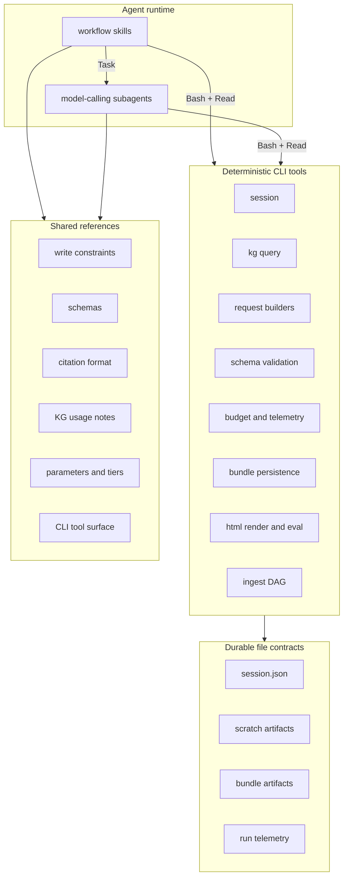

# Wikify: skill-centric pivot (agent-driven, session-backed)

## Review outcome

This revision adopts the architecture the user wants, with one missing piece
now made explicit: a durable run session object.

- The agent runtime is the only place that calls models.
- Skills are the primary workflow surface.
- Python is the backend for deterministic tools, schemas, validation,
  persistence, telemetry, and session management.
- `.claude/skills/` is the first skill pack, not the architecture truth.
- The agent owns orchestration.
- The CLI acts as a sandbox and harness.
- A persistent session object is the durable coordination point between them.

The key split is:

- agent runtime: planning, model calls, tool calls, subagents, workflow execution
- Python backend: deterministic tools, validation, persistence, strategy state,
  telemetry, and session durability

## Goal

Run Wikify primarily through agent skills and tool use, with no Python
model-calling path, while keeping the scientific core testable, inspectable,
portable, and resumable.

This is aspirational in stages, not all at once. The full autoresearch shape is
the target architecture. The self-guided strategy skill should move closest to
that shape first. Baseline and scripted strategies can adopt the same session,
tool, and artifact contracts earlier while remaining more constrained and
procedural.

## Non-goals

- Calling models from Python
- Replacing all deterministic Python tool code with skill markdown
- Using hidden in-memory runtime state as the source of truth
- Baking vendor-specific model names into core Python contracts
- Letting models write canonical artifacts directly with no validation layer

## Direct answer: is this vendor agnostic?

Yes at the core, no at the exact runtime-semantics layer.

Portable:

- tool contracts
- session schema
- bundle schema
- telemetry schema
- strategy parameters
- file layouts
- deterministic Python services

Not fully portable:

- skill packaging
- skill frontmatter
- subagent syntax
- tool permission semantics
- context-loading behavior
- vendor runtime ergonomics

So the correct claim is:

- a skill-driven, tool-backed architecture can be vendor-agnostic enough
- a specific skill runtime is not fully vendor agnostic

## Best practices for skill workflows

- Keep top-level skills short and operational.
- Use progressive disclosure. Put detail in shared references, not in every skill.
- Keep deterministic logic in Python tools or scripts, not in prose.
- Prefer a few strong workflows over many tiny skills.
- Keep one canonical source of truth for schemas, constraints, and state transitions.
- Make skills call stable tool contracts instead of re-encoding backend logic.
- Treat skill files as workflow assets, not as the durable system of record.
- Make the session object explicit and inspectable.

## Autoresearch framing

This plan should eventually be framed as Wikify-style `autoresearch`.

The useful idea from Karpathy's `autoresearch` repo is the loop shape:

- the human provides the program and the starting objective
- the agent runs an iterative loop autonomously
- each iteration creates artifacts, evaluates them, keeps or discards results,
  and updates durable run state
- the loop stops only when explicit stopping criteria are met

For Wikify, that becomes:

- the user triggers a workflow through a skill
- the skill creates or resumes a session
- the orchestrator iterates on wiki creation autonomously
- each iteration selects work, drafts artifacts, validates them, commits them,
  updates telemetry, and decides whether to continue
- the loop stops when stopping criteria say "enough"

This is a better framing than "one workflow run". The system's job is not to
execute one pipeline pass. Its job is to keep researching and improving the
bundle until the session says the target has been met or the run should stop.

### Aspirational rollout

This framing is directional for the whole system, but it should land unevenly:

- `run-baseline.md` proves the tool, session, scratch, and promotion contracts
- scripted E/M/X skills remain more constrained and procedural at first
- `run-guided.md` is the primary autoresearch-style skill and should become the
  strongest autonomous loop earliest

In other words:

- baseline proves the architecture
- scripted proves modular strategy workflows
- self-guided proves the true autoresearch loop

### Autoresearch loop for Wikify

Canonical loop:

1. Initialize or resume session
2. Inspect current bundle and session state
3. Choose the next unit of work
4. Prepare request artifacts
5. Call model subagents
6. Validate outputs
7. Promote valid outputs into the bundle
8. Update telemetry and session state
9. Evaluate stopping criteria
10. Repeat or close session

### Stopping criteria

The loop must stop for explicit reasons, not because the skill runs out of prose.

Minimum stopping criteria:

- budget exhausted
- no high-value pending work remains
- novelty gain falls below threshold for N iterations
- coverage target reached
- page-quality target reached
- validation failures exceed threshold
- user-configured max iterations reached
- user interrupts or closes the session

Recommended rule:

- stopping criteria live in session state and are readable by the workflow
- the workflow may tighten them during a run only through explicit session updates

### What this changes in the plan

- workflows are long-lived autonomous loops, not one-shot scripts
- session state must include loop counters, stopping criteria, and recent gains
- telemetry must make "why did the loop stop?" easy to answer
- `run-baseline.md` is the first autoresearch-style vertical slice

Primary source:

- https://github.com/karpathy/autoresearch
- https://github.com/karpathy/autoresearch/blob/master/program.md

## KPI / metrics framework

From an autoresearch perspective, KPI definition is mandatory. The loop cannot
decide whether to continue, revise, or stop unless the objective function is
explicit.

### Principles

- KPIs must be computable from durable artifacts, not private agent judgment.
- KPIs should distinguish optimization targets from safety and quality gates.
- KPIs must be tracked per iteration in session state and run telemetry.
- A workflow may optimize a small primary KPI set, but it must never ignore hard quality floors.

### KPI categories

Use four categories:

1. **Primary outcome KPIs**
   The main objective the workflow is trying to improve.
2. **Quality gates**
   Hard minimums below which the run is considered invalid or degraded.
3. **Efficiency KPIs**
   Budget, latency, and token-cost signals used to decide whether improvement is worth the spend.
4. **Progress KPIs**
   Signals that tell the orchestrator whether more looping is likely to pay off.

### Candidate primary outcome KPIs for Wikify

- grounded page count
- grounded person-page count
- evidence density per page
- citation coverage over selected concepts
- rendered page quality review pass rate
- eval metrics already tracked in the project such as M1-M6, GT-P, GT-C where appropriate

The exact mix can vary by workflow, but each workflow should declare its primary KPI set explicitly.

### Candidate quality gates

- schema-valid bundle artifacts
- no blank or undrafted persisted pages
- HTML render succeeds
- references and internal links resolve
- minimum evidence floor per page
- no banned placeholder or corpus-meta phrasing
- no severe regressions on evaluation metrics relative to the previous accepted checkpoint

Quality gates are not optimization targets. They are admission criteria.

### Candidate efficiency KPIs

- haiku-equivalent tokens spent
- cost per accepted page
- cost per accepted improvement
- iterations to convergence
- validation failure rate
- discarded-draft rate

### Candidate progress KPIs

- novelty gain over the last N iterations
- newly grounded pages per iteration
- reduction in uncovered target concepts
- reduction in missing-citation or validation-error backlog
- marginal improvement in chosen eval metrics

### KPI ownership

- the workflow skill chooses which KPI family matters for the current run
- the deterministic Python backend computes and persists KPI values
- session state stores the latest KPI snapshot and recent deltas
- stop criteria reference named KPI fields, not free-form agent prose

### Session fields for KPIs

Add or reserve fields such as:

- `kpi_snapshot`
- `kpi_history_path`
- `primary_kpis`
- `quality_gates`
- `progress_window`
- `acceptance_policy`

### Acceptance policy

Each workflow should define an explicit acceptance policy for iterative changes.

Examples:

- accept a draft only if quality gates pass
- accept a loop iteration only if primary KPIs improve or progress KPIs justify continued search
- stop if progress KPIs remain flat for N iterations
- roll back or mark failed if quality gates regress

This is the Wikify equivalent of autoresearch's "keep or discard" rule.

## Target architecture

Invariants:

- the agent runtime calls models and tools
- skills own the per-iteration control loop
- deterministic tools are CLI subprocesses
- model-calling steps are subagents
- the control loop is autoresearch-style: iterate until stopping criteria are met
- Python owns the canonical implementation of deterministic, stateful,
  cross-cutting concerns
- durable state lives on disk in explicit files, not hidden process memory
- skills orchestrate tools, but do not become the source of truth for tool behavior

## Persistent run-state / session object

The missing piece is an explicit, durable session object. If skills own the
loop, they still need a stable state carrier that survives:

- subagent boundaries
- CLI subprocess boundaries
- agent restarts
- long-running refine and campaign workflows

The session object is therefore a first-class part of the tool surface.

### Session principles

1. **Explicit, not implicit.** There is no unnamed "current run".
2. **Durable.** Session state lives on disk and is resumable.
3. **Inspectable.** A human can open the session file and understand run state.
4. **CLI-mutated.** The agent may read the session directly, but canonical session mutations happen through CLI commands.
5. **Checkpointed.** Every meaningful transition leaves the run resumable.
6. **Scoped.** Every scratch artifact belongs to exactly one session.
7. **Lockable.** Mutating tools can prevent two workflows from corrupting the same session.

### Session file

Canonical location:

- bundle-bound runs: `<bundle>/_session/session.json`
- scratch-only exploratory runs: `<scratch>/<run_id>/session.json`

Minimum fields:

- `schema_version`
- `tool_surface_version`
- `run_id`
- `created_at`
- `updated_at`
- `workflow`
- `status`
- `corpus_path`
- `bundle_path`
- `scratch_dir`
- `strategy_id`
- `mode`
- `seed`
- `budget_target_haiku_eq`
- `budget_spent_haiku_eq`
- `write_reserve_haiku_eq`
- `current_phase`
- `current_step`
- `artifacts`
- `pending_actions`
- `completed_actions`
- `errors`

Recommended fields:

- `coverage_state_path`
- `pages_manifest_path`
- `telemetry_path`
- `calls_path`
- `active_page_id`
- `active_chunk_ids`
- `transcript_path`
- `lock`
- `iteration_index`
- `recent_gains`
- `stopping_criteria`
- `stop_reason`
- `kpi_snapshot`
- `acceptance_policy`

### Session statuses

Use a small fixed vocabulary:

- `created`
- `running`
- `awaiting_model`
- `validating`
- `paused`
- `completed`
- `failed`
- `abandoned`

### Session mutation rules

- The agent may read the session directly.
- The agent does not hand-edit canonical session fields with raw shell writes.
- The CLI owns canonical mutations: `session init/show/update/checkpoint/close`.
- Free-form model output is written to scratch artifacts first.
- Validation happens before promotion.
- Promotion into canonical bundle artifacts happens through CLI commands only.

### Locking and concurrency

Assume one orchestrating workflow at a time unless concurrency is explicitly designed.

Best practices:

- session carries a `lock` record with `owner`, `acquired_at`, `expires_at`
- mutating commands fail fast if the lock is held by another actor
- subagents work on disjoint scratch artifacts
- the parent workflow owns promotion into canonical state

### Checkpoint strategy

Checkpoint after:

- session creation
- chunk selection
- request artifact creation
- model output receipt
- validation result
- page commit
- iteration end
- render/eval completion
- final session close

Guiding rule: if the agent stops after any step, the next agent should be able
to resume from the session without guessing.

## CLI tool surface and file contracts

The CLI is the load-bearing surface between the agent and the Python backend.
Design it like the Unix tool surface that LLMs already use well: small,
composable, typed, and explicit about side effects.

### Principles

1. **Narrow surface.** The agent interacts with a small, enumerable command set.
2. **Files are the interface.** Commands pass paths, not large blobs.
3. **Token-light by construction.** Default outputs are IDs and summaries.
4. **Versioned schemas.** Every durable file has `schema_version`.
5. **Enumerable file types.** The agent does not invent new file types mid-workflow.
6. **Stable exit codes and stderr contract.** `0` success, nonzero documented failure.
7. **No hidden state.** Every command is a function of flags, file paths, corpus files, and explicit session files.
8. **Composable with Unix primitives.** The agent can mix `wikify` with `Read`, `Glob`, and shell tools without surprises.

### CLI families

Use a few stable families:

- `wikify session ...`
- `wikify kg ...`
- `wikify draft ...`
- `wikify validate ...`
- `wikify bundle ...`
- `wikify render ...`
- `wikify eval ...`
- `wikify ingest ...`

These families are intentionally boring. The agent should be able to learn them once.

### Session commands

Minimum proposed commands:

- `wikify session init --workflow ... --corpus ... --bundle ...`
- `wikify session show --session ...`
- `wikify session update --session ... --patch ...`
- `wikify session checkpoint --session ...`
- `wikify session lock --session ...`
- `wikify session unlock --session ...`
- `wikify session close --session ... --status completed|failed|abandoned`

Important rules:

- `init` creates the directory layout and session file
- all later mutating commands take `--session <path>` explicitly
- no command infers session from cwd

### File types the agent is allowed to touch

Enumerate in `.claude/skills/wikify/reference/schemas.md`. Initial set:

- **read-only, corpus-side:** raw papers, parsed chunks, knowledge graph export
- **read/write, session-side:** `_session/session.json`, `_session/checkpoints/*.json`
- **read/write, bundle-side:** `bundle.json`, `pages/*.json`, `citations.json`, `_run.json`, `_calls.jsonl`
- **read/write, scratch:** `<scratch>/extract-<id>.json`, `<scratch>/draft-<page>.json`, `<scratch>/response-<id>.json`, `<scratch>/validation-<id>.json`

The agent creates scratch files only through `wikify` CLI commands, not by inventing arbitrary file writes.

### Scratch artifact policy

Scratch files are where the model is allowed to think in artifacts without
damaging canonical outputs.

Best practices:

- every scratch file belongs to exactly one session
- every scratch file has a schema and status
- scratch files are phase-typed: request, response, draft, validation, delta
- promotion to bundle artifacts happens only through validate + commit commands
- scratch files are clearable between runs and archiveable for debugging

Recommended scratch statuses:

- `created`
- `filled`
- `validated`
- `rejected`
- `promoted`
- `superseded`
- `archived`

### Token-light output discipline

CLI commands default to IDs and summaries, with a `--full` flag only when needed.

Examples:

- `wikify kg query --topic X` -> `{results: [{id, title, score, source_id}, ...]}`
- `wikify validate --file draft.json` -> `{ok: false, errors: [{path, code, message}]}`
- `wikify bundle list --bundle B` -> `{pages: [{id, kind, status}]}`

The agent decides when to spend tokens by explicitly requesting full content.

### Failure modes

- A command that would emit too much stdout writes to a file and returns the path.
- Commands that list many results paginate or emit jsonl.
- Schema violations are never silent.
- Session inconsistency is a first-class error.

## Revised atom / skill boundary

Rule:

- If behavior must be deterministic, tested, replayable, or compared across runs, keep it in Python.
- If behavior is workflow guidance, tool-selection logic, runtime-specific invocation advice, or reusable task instructions for an agent, make it a skill or reference file.

### Keep in Python as CLI-exposed tools

- `preload_corpus`
- `KnowledgeGraph` and query builders
- request builders for extract, edit, compact, write, query, maintenance
- prompt assembly and prompt-layer loading helpers
- response validation and structural checks
- coverage state updates
- strategy parameter sets, budget allocation, telemetry discriminators
- cache and cost metering
- session schema, checkpointing, locking, and consistency validation
- bundle writing and finalization
- `html` render, `eval`, and `ingest`

### Put in skills

- operator workflows for common user-facing tasks
- scripted strategy variants: `run-scripted-E.md`, `run-scripted-M.md`, `run-scripted-X.md`
- guided mode: `run-guided.md`
- the per-iteration control loop for scripted and guided
- reusable write/extract/query/orchestrate instructions that point to shared references
- runtime-specific guidance on how to invoke CLI tools and subagents

### Important correction

Prompt assembly and validation are not skills. They are deterministic support code.

## Skills workflow structure

If skills own orchestration, they need strong structure or they will sprawl.

### Layers

Use four layers only:

1. **Workflow skills**
   End-to-end owners like `run-baseline.md` or `run-guided.md`
2. **Phase references**
   Extract, draft, validate, commit, render, eval
3. **Domain references**
   Schemas, KG usage, citation format, write constraints, tiers
4. **CLI references**
   Deterministic tool surface and file contracts

Avoid adding a fifth "micro-handler" layer unless repeated adapter logic clearly justifies it.

### Workflow skill template

Each workflow skill should have:

- purpose
- inputs
- required session state
- commands it may invoke
- model-calling steps
- artifacts it creates
- validation checkpoints
- completion criteria
- failure/resume instructions

### Phase decomposition

For the first vertical slices, decompose into:

- `init-session`
- `evaluate-stop`
- `select-work`
- `prepare-request-artifacts`
- `call-model`
- `validate-output`
- `commit-artifacts`
- `update-session`
- `render-and-eval`
- `close-session`

Each phase should correspond to a small set of CLI commands and file mutations.

### Modularity rules

- Workflow skills may call subagents, but subagents should usually work against scratch artifacts, not canonical bundle files.
- The parent workflow owns session mutation and promotion steps.
- Reference files are fact stores, not action scripts.
- A skill should not restate a schema that already lives in a reference file.
- A workflow should not require reading the whole repo to proceed.

## What to build

### 1. Shared references

Consolidate duplicated guidance into:

- `.claude/skills/wikify/reference/write-constraints.md`
- `.claude/skills/wikify/reference/schemas.md`
- `.claude/skills/wikify/reference/citation-format.md`
- `.claude/skills/wikify/reference/escalation.md`
- `.claude/skills/wikify/reference/tiers.md`
- `.claude/skills/wikify/reference/atoms.md`
- `.claude/skills/wikify/reference/cli-tool-surface.md`

These contain facts and contracts, not workflow steps.

### 2. Agent-facing workflow skills

Keep a small number of top-level workflows:

- `.claude/skills/wikify/workflows/run-scripted-E.md`
- `.claude/skills/wikify/workflows/run-scripted-M.md`
- `.claude/skills/wikify/workflows/run-scripted-X.md`
- `.claude/skills/wikify/workflows/run-guided.md`
- `.claude/skills/wikify/workflows/run-baseline.md`
- `.claude/skills/wikify/workflows/run-campaign.md`
- `.claude/skills/wikify/workflows/ask.md`

Each workflow should:

- assume the agent runtime calls the model via subagents
- use the session file explicitly
- invoke deterministic CLI tools for typed transitions, validation, and persistence
- own the autoresearch loop in skill prose
- point to shared references instead of duplicating schemas
- stay short enough to load cheaply

Autonomy expectation by workflow:

- `run-baseline.md`: lowest autonomy, highest determinism
- `run-scripted-{E,M,X}.md`: medium autonomy, constrained loop
- `run-guided.md`: highest autonomy, closest to the target autoresearch shape

### 3. Handler skills: open question

The earlier plan proposed a handler layer (`handlers/extract.md`,
`handlers/write.md`, etc.). Under a strong session + CLI surface, these may be
redundant. Defer the decision.

Build the first vertical slice (`run-baseline.md`) without handler skills.
Reintroduce them only if repeated adapter logic proves they are useful.

### 4. Python cleanup and tool extraction

Refine the core around reusable atoms and expose them via CLI:

- make request-building helpers callable via CLI subcommands that emit JSON to disk
- expose validation and persistence helpers as CLI commands
- add a session service layer that owns session schema, locking, checkpointing, and consistency validation
- keep `distill/pipeline.py` as the current backend until the skill-driven path reaches parity, then delete per workflow
- keep `baselines/pipeline.py` until `run-baseline.md` reaches parity, then delete
- shrink `distill/strategy.py` to parameter sets, budget math, and telemetry discriminators only
- `dispatch.py` is a deletion candidate; do not extend it
- dispatch-only CLI wrappers are deletion candidates once workflows are proven

## Fluent KG API improvements

These still make sense because they improve the deterministic tool surface:

- add `KnowledgeGraph.similar_chunks(chunk_id, top_k)`
- add typed citation walk helpers like `.references(hops=N)` and `.cited_by(hops=N)`
- add `KnowledgeGraph.abstracts()`
- add `.unique_by_source(per_source=1)`
- add chainable ordering such as `.order_by("pagerank")`

These belong in Python with pytest coverage.

## What not to delete yet

Keep these until the skill-driven path reaches parity:

- `src/wikify/distill/pipeline.py`
- `src/wikify/baselines/pipeline.py`
- `src/wikify/distill/write_runner.py` until reusable pieces are exposed as CLI tools
- `src/wikify/distill/query.py`
- `src/wikify/distill/maintenance.py`
- `src/wikify/cli.py` commands for `html`, `eval`, and `ingest`

Deletion candidates, but do not delete yet:

- `src/wikify/dispatch.py`
- `src/wikify/cli.py` commands for `distill`, `campaign`, and `query` if their only role is old dispatch paths
- control-flow portions of `src/wikify/distill/strategy.py`

Delete outright:

- duplicated prose across skills after reference consolidation
- dead adapter glue once replacement is proven
- dead tests that only cover removed adapter glue

## Key limitations and pitfalls

### Skill/runtime mismatch

Mitigation:

- model calls happen in the agent runtime
- stateful deterministic behavior stays in Python
- skills point to tools instead of re-encoding tool logic

### Skill sprawl

Mitigation:

- prefer a few top-level workflows plus references
- create a skill only when it owns a reusable workflow

### Prompt drift

Mitigation:

- keep canonical constraints in references and validation in Python
- snapshot prompt assembly in tests

### State durability

Mitigation:

- keep state in Python and on disk
- make the session object the only durable coordination point

### Session drift

Mitigation:

- one canonical session schema
- one CLI family responsible for session mutations
- consistency validation after each promotion step
- lock and checkpoint semantics defined before parallel subagent use

### Observability loss

Mitigation:

- keep telemetry and action logs in Python
- require parity with `_run.json`, `_calls.jsonl`, and session checkpoints

### Reproducibility risk

Mitigation:

- keep strategy parameters and discriminators in Python
- keep workflow transcripts and parity fixtures under version control

### Vendor lock-in

Mitigation:

- define one runtime-neutral Python tool contract
- treat each skill pack as an adapter over that contract

### Testability gap

Mitigation:

- move repeated logic into Python helpers and scripts
- use skill smoke tests and parity tests, not skill-only logic

## Testing strategy

### Python atoms and services

Use normal pytest coverage for:

- KG helpers
- request builders
- prompt assembly
- schema validation
- budget allocation
- cache and telemetry
- session schema, checkpointing, locking, and consistency validation

### Skill adapter tests

Add lightweight tests that check:

- frontmatter parses
- referenced files exist
- referenced Python symbols still import
- workflow steps only reference documented CLI commands
- workflow steps only create allowed session and scratch artifact types

### Parity tests

Parity is schema-level first, artifact-level second.

Mechanism: recorded-transcript parity.

1. Exercise the current Python entrypoint with a canned corpus and record model request/response pairs to `tests/wikify/fixtures/transcripts/`.
2. Run the skill-driven workflow against the same canned corpus, replaying the transcript to the model-calling subagents.
3. Assert that bundle JSON, `_run.json`, and `_calls.jsonl` field-sets are structurally identical.
4. Assert that session checkpoints and scratch artifacts obey their schemas and are resumable.
5. Render HTML and check visible artifacts with the Quality Review Protocol.

Live-subagent smoke runs happen manually, not in CI.

## Revised migration sequence

### Phase 0: reference consolidation

- create the shared reference files
- trim duplicated text from skills
- add smoke tests for skill metadata, reference existence, and imports

### Phase 1: Python tool-contract cleanup

- make request builders, prompt assembly, and validation boundaries explicit
- tighten import paths for reusable atoms
- add the KG helper methods and tests
- identify which runtime functions become explicit tool surfaces
- define the session schema and implement `wikify session init/show/update/checkpoint/close`

### Phase 2: workflow-skill cleanup

- simplify workflow skills so they wrap current CLI and tool entrypoints
- keep them short and reference-driven
- make "agent calls model, then uses Python tools" the explicit default
- define allowed scratch artifact types and promotion steps

### Phase 3: `run-baseline.md` vertical slice

Build one end-to-end workflow over the hybrid tool surface:

- `run-baseline.md` owns the control loop in skill prose over an explicit session file
- deterministic steps invoked as CLI subcommands
- model-calling steps invoked as subagents
- success criterion: bundle JSON schema, `_run.json`, and `_calls.jsonl` field-sets structurally identical to current baseline output
- session can be paused and resumed mid-run without guessing
- loop stop reason is recorded explicitly in the session and telemetry

This is the first production vertical, not a toy pilot.

### Phase 4: expand to scripted/guided

- add scripted E/M/X workflows
- add guided workflow
- keep the same session and scratch discipline

### Phase 5: deletion decision

Delete code when all of these are true:

- parity holds on bundle and telemetry schemas
- downstream `html` render and `eval` continue to work unchanged
- session checkpoints are resumable
- stopping criteria behave deterministically on replayed transcripts
- the new path is easier to test and maintain

Deletion is per workflow, not all-or-nothing.

## Verification

For each phase:

1. `uv run ruff check src/wikify tests/wikify`
2. `uv run pytest tests/wikify -q`
3. skill smoke tests pass
4. at least one real bundle is rendered to HTML and reviewed with the Quality Review Protocol
5. workflow outputs match the existing runtime's bundle JSON and telemetry field-sets for the same canned inputs
6. no Python path directly calls vendor model APIs
7. every workflow mutation of durable state goes through the session contract
8. every CLI tool the agent invokes has a documented input schema, output schema, and stable exit codes
9. every closed session records a stop reason and the stopping criterion that fired
10. every iterative workflow records KPI snapshots and the acceptance decision for each iteration

## Decision summary

The committed shape of this plan:

- **skill-driven control flow.** Skills own the loop.
- **agent-driven model calls.** Model-calling steps are subagents.
- **CLI-only deterministic tool surface.** Python exposes narrow deterministic commands.
- **session-centric orchestration.** Skills orchestrate through an explicit, durable session object.
- **autoresearch loop.** The orchestrator iterates autonomously on wiki creation until explicit stopping criteria are met.
- **file-contract-centric.** Intermediate artifacts are typed, versioned files.
- **scratch-before-promotion.** Model output lands in scratch, is validated, then promoted.
- **baseline-first.** `run-baseline.md` is the first merge-worthy autoresearch vertical slice.

That keeps the benefits of skills without giving up reproducibility,
portability, resumability, or testability.
